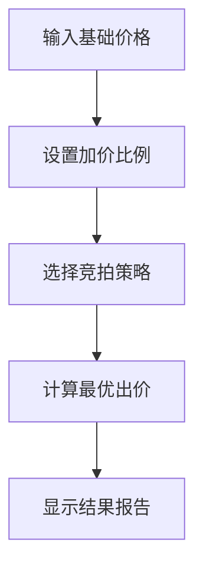

## 1. Product Overview
竞拍之王计算器是一款专为竞拍爱好者设计的智能计算工具，帮助用户快速计算最优竞拍策略和价格。
- 核心功能：实时计算竞拍价格、利润分析、风险评估
- 目标用户：电商平台竞拍参与者、收藏爱好者、二手交易卖家

## 2. Core Features

### 2.1 User Roles
| Role | Registration Method | Core Permissions |
|------|---------------------|------------------|
| User | None | Use all calculator features |

### 2.2 Feature Module
1. **价格计算器**: 基础价格计算、加价策略、税费计算
2. **利润分析**: 成本分析、预期收益、盈亏平衡点
3. **风险评估**: 风险概率、止损建议、最优出价

### 2.3 Page Details
| Page Name | Module Name | Feature description |
|-----------|-------------|---------------------|
| Calculator | Price Input | 输入商品基础价格、加价幅度、税费比例 |
| Calculator | Strategy Select | 选择竞拍策略（激进、稳健、保守） |
| Calculator | Result Display | 显示最优出价、预期利润、风险等级 |

## 3. Core Process
用户输入商品信息 → 选择竞拍策略 → 系统计算最优出价 → 显示详细分析报告

## 4. User Interface Design
### 4.1 Design Style
- Primary Color: #FF6B6B (活力红)
- Secondary Color: #4ECDC4 (清新青)
- Accent Color: #FFE66D (明亮黄)
- Button Style: 圆角矩形，渐变背景，悬停发光效果
- Font: 现代无衬线字体，标题粗体，内容常规
- Layout: 卡片式布局，清晰的信息层级

### 4.2 Page Design Overview
| Page Name | Module Name | UI Elements |
|-----------|-------------|-------------|
| Calculator | Input Section | 价格输入框、滑块、下拉选择 |
| Calculator | Strategy Cards | 三种策略卡片，点击切换 |
| Calculator | Result Panel | 大数字显示、进度条、风险指示 |

### 4.3 Responsiveness
- Desktop-first design
- Mobile-adaptive: 单列布局，触控友好的按钮尺寸

### 4.4 Animation
- 计算结果数字滚动动画
- 策略卡片切换过渡效果
- 风险等级颜色渐变