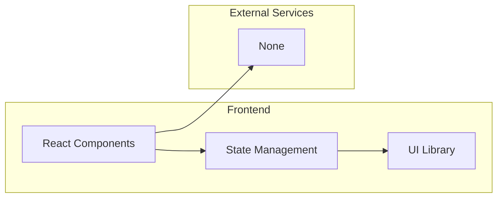

## 1. Architecture Design


## 2. Technology Description
- Frontend: React@18 + TypeScript + TailwindCSS@3 + Vite
- Initialization Tool: vite-init
- Backend: None (纯前端计算)
- Database: None

## 3. Route Definitions
| Route | Purpose |
|-------|---------|
| / | 首页，竞拍计算器主界面 |

## 4. Component Structure
```
src/
├── components/
│   ├── Calculator.tsx      # 主计算器组件
│   ├── PriceInput.tsx      # 价格输入组件
│   ├── StrategySelector.tsx # 策略选择组件
│   ├── ResultPanel.tsx     # 结果展示组件
│   └── RiskIndicator.tsx   # 风险指示器组件
├── utils/
│   └── calculator.ts       # 计算逻辑工具函数
├── App.tsx
└── main.tsx
```

## 5. Data Model

### 5.1 Input Data
| Field | Type | Description |
|-------|------|-------------|
| basePrice | number | 商品基础价格 |
| markupRate | number | 加价比例 (0-100%) |
| taxRate | number | 税费比例 (0-50%) |
| strategy | string | 竞拍策略 (aggressive/balanced/conservative) |

### 5.2 Output Data
| Field | Type | Description |
|-------|------|-------------|
| optimalBid | number | 最优出价 |
| expectedProfit | number | 预期利润 |
| riskLevel | string | 风险等级 (high/medium/low) |
| breakEvenPoint | number | 盈亏平衡点 |
| recommendedMaxBid | number | 建议最高出价 |

## 6. Calculation Logic

### 6.1 最优出价计算公式
- 激进策略: optimalBid = basePrice * (1 + markupRate * 0.01) * 1.3
- 稳健策略: optimalBid = basePrice * (1 + markupRate * 0.01) * 1.15
- 保守策略: optimalBid = basePrice * (1 + markupRate * 0.01) * 1.05

### 6.2 风险评估
- 高风险: 预期利润 > 50%
- 中风险: 预期利润 20%-50%
- 低风险: 预期利润 < 20%